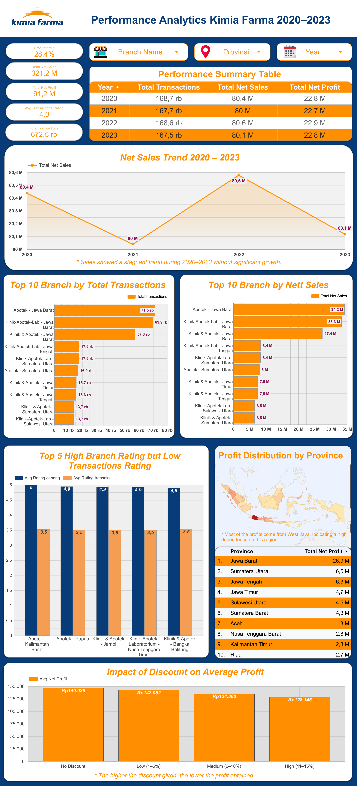

# 📊 Kimia Farma Business Performance Analysis (2020–2023)

## 📌 Overview
This project analyzes Kimia Farma’s business performance from 2020 to 2023 using transaction, branch, and product data. The analysis aims to identify key business insights and provide data-driven recommendations to improve performance and support strategic decision-making.

---

## 📑 Table of Contents
- [Background](#background)
- [Business Problem](#business-problem)
- [Objectives](#objectives)
- [Dataset](#dataset)
- [Tools & Technologies](#tools--technologies)
- [Project Workflow](#project-workflow)
- [Data Processing](#data-processing)
- [Dashboard Preview](#dashboard-preview)
- [Key Insights](#key-insights)
- [Business Recommendations](#business-recommendations)
- [Conclusion](#conclusion)
- [Project Structure](#project-structure)
- [Author](#author)

---

## 📌 Background
Kimia Farma’s sales performance during the 2020–2023 period shows a relatively fluctuating pattern but tends to be stable overall. This indicates variations in performance across time, regions, and branches.

Additionally, there is a potential gap between branch service quality and customer transaction experience, as well as the impact of discount strategies on profitability.

---

## ❗ Business Problem
- Sales performance is relatively stable but shows no significant growth  
- Business performance is uneven across regions and branches  
- There is a gap between branch ratings and transaction ratings  
- Discount strategies may negatively impact profitability  

---

## 🎯 Objectives
- Analyze sales and profit trends (2020–2023)  
- Identify top-performing branches and provinces  
- Detect gaps in customer experience (rating analysis)  
- Evaluate the impact of discount strategies on profit  
- Provide data-driven business insights and recommendations  

---

## 📂 Dataset
This project uses three main datasets:

- **kf_final_transaction** → Sales transactions (date, sales, profit, discount, rating)  
- **kf_product** → Product information (name, category, price)  
- **kf_kantor_cabang** → Branch information (location, rating)  

All datasets are combined into an analytical table:
> **kf_analysis (Master Table)** → Used for dashboard and analysis

---

## 🛠️ Tools & Technologies
- **BigQuery** → Data processing and transformation  
- **SQL** → Data analysis and table creation  
- **Looker Studio** → Dashboard visualization  
- **GitHub** → Project documentation  

---

## 🔄 Project Workflow
The project follows an end-to-end data analysis process:

1. Data Ingestion → Import dataset into BigQuery  
2. Data Understanding → Analyze structure and relationships  
3. Data Processing → Join datasets using SQL  
4. Data Transformation → Create analysis table (`kf_analysis`)  
5. Data Visualization → Build dashboard in Looker Studio  
6. Reporting → Generate insights and recommendations  

---

## ⚙️ Data Processing
The data is processed using SQL in BigQuery by combining transaction, product, and branch datasets.

Key steps include:
- Joining datasets using primary keys  
- Calculating net sales and net profit  
- Creating a final analytical table (`kf_analysis`)  

---

## 📊 Dashboard Preview


---

## 📈 Key Insights

### 1. Sales Performance Trend
Sales remain stable around ~80M annually, showing no significant growth, indicating a stagnant business condition.

### 2. Branch Performance
West Java branches dominate both transaction volume and sales, indicating uneven business distribution.

### 3. Geographical Distribution
Most profits come from West Java, highlighting strong regional dependency.

### 4. Customer Experience
There is a gap between high branch ratings and lower transaction ratings, indicating service quality issues.

### 5. Discount Impact
Higher discounts lead to lower profit, indicating an ineffective discount strategy.

---

## 💡 Business Recommendations

### 1. Drive Sales Growth Strategy
Develop more aggressive marketing strategies and product expansion to overcome stagnant growth.

### 2. Reduce Regional Dependency
Improve performance in other regions to balance profit distribution and reduce risk.

### 3. Optimize Discount Strategy
Limit excessive discounts and apply data-driven pricing strategies.

### 4. Improve Service & Operations
Enhance service quality and operational processes to improve customer experience.

---

## 🏁 Conclusion
Kimia Farma’s business performance is stable but lacks significant growth. The business is highly dependent on certain regions and faces operational challenges that affect profitability. Strategic improvements are required to enhance growth, efficiency, and overall performance.

---

## 📁 Project Structure

```bash
assets/
  dashboard.png
  erd.png

dokumen/
  project_overview.md
  business_insight.md
  dashboard_explanation.md

eda/
  eda_01_sales_trend.sql
  eda_02_profit_by_province.sql
  eda_03_top_branch.sql
  eda_04_top_product.sql
  eda_05_discount_profit.sql
  eda_06_top_transaction_branch.sql
  eda_07_top_sales_branch.sql
  eda_08_rating_issue_branch.sql

sql/
  01_data_understanding.sql
  02_join_branch.sql
  03_join_product.sql
  04_create_analysis_table.sql
```

---

## 👤 Author
**Rehana Putri Salsabilla**  
📧 rehanaputri80@gmail.com  
🔗 Portfolio: https://rehanaprofile.netlify.app  
💼 Data Analyst Enthusiast  

---